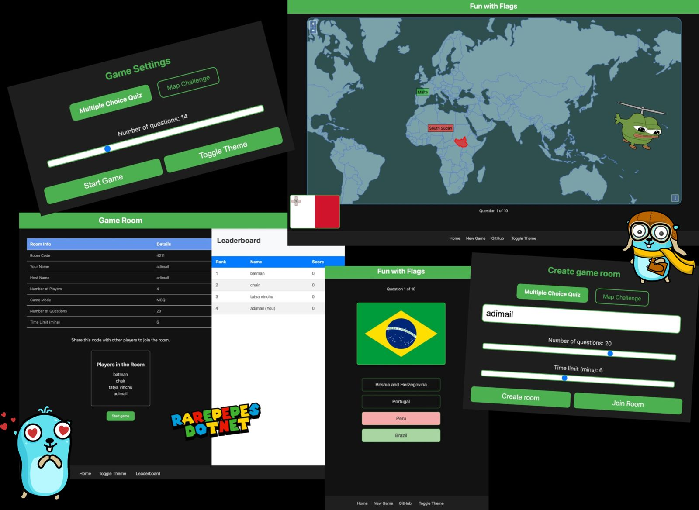
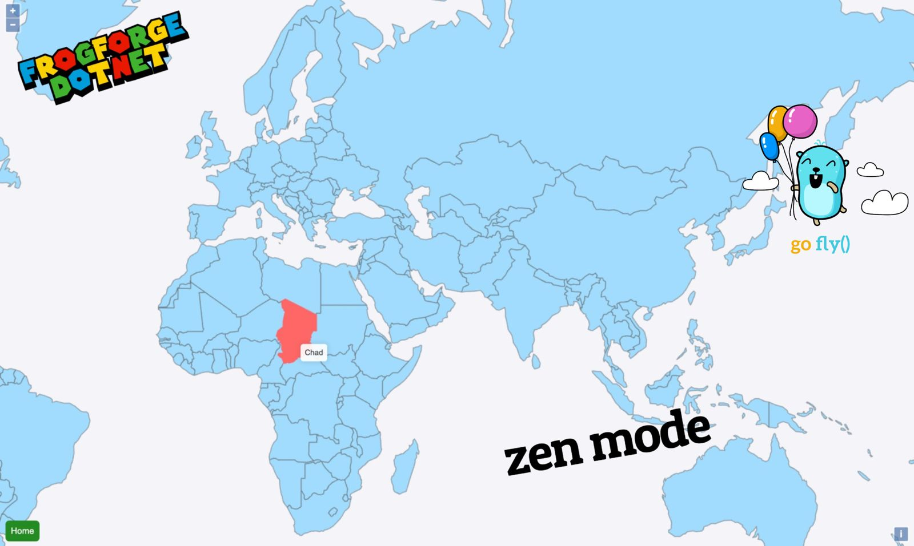
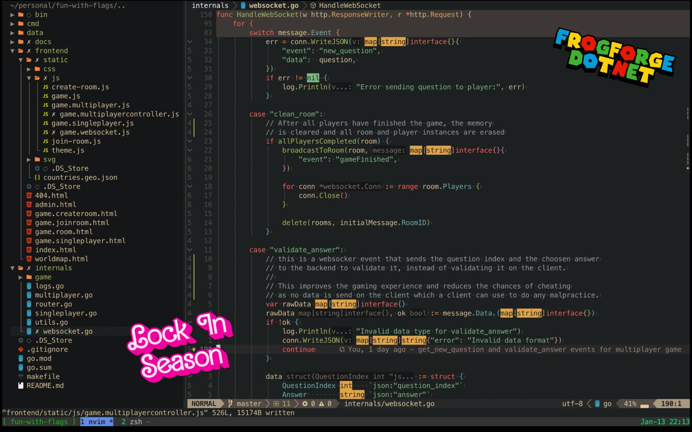

# Fun with Flags

Web-based multiplayer game designed to test your knowledge of country flags. The game offers both single-player and multiplayer modes, allowing players to create or join game rooms.

## Game Modes

1. **Flag-to-Country Mode (MCQ)**

   - Players are presented with a flag image and must select the correct country name from the options provided.

2. **Map challenge**
   - Players are given a country flag and must locate it on a world map based on its flag.

Both modes are available for single-player and multiplayer gameplay.

## Technology Stack

- **Backend**: Built using Go, with Gorilla Web Toolkit for handling WebSocket connections and RESTful APIs.
- **Frontend**: Developed using HTML, CSS, and vanilla JavaScript for a seamless user interface.
- **Real-Time Communication**: WebSocket technology ensures low-latency interactions between players.

## Screenshots







## Building Locally

1. **Install Dependencies**

   Ensure you have Go installed. Then, run:

   ```bash
   go mod download
   ```

2. **Run the Server**

   ```bash
   make run
   ```

## License

"Fun with Flags" is licensed under the MIT License. See the [LICENSE](LICENSE) file for more details.
